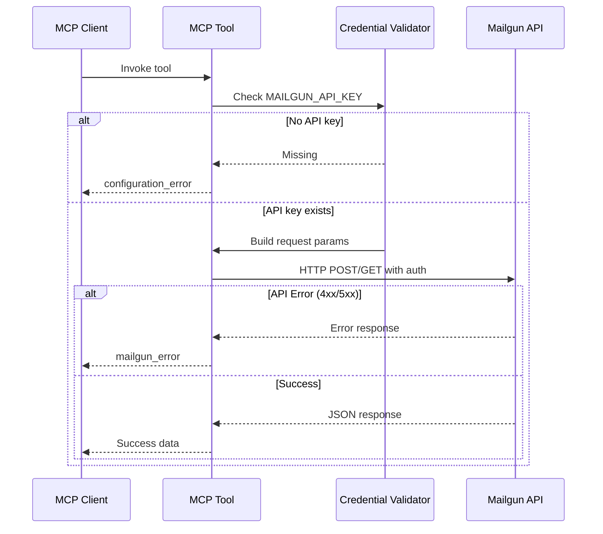
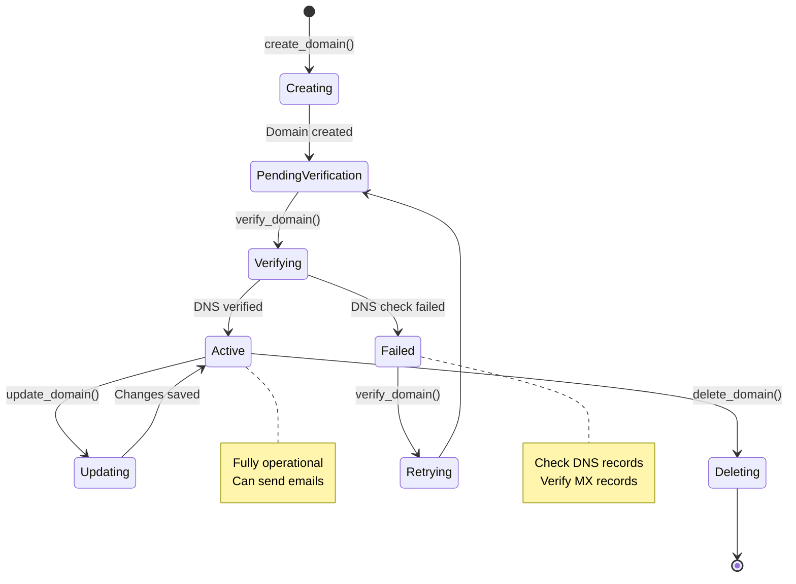

# CLAUDE.md

This file provides guidance to Claude Code (claude.ai/code) when working with code in this repository.

## Project Overview

This is a comprehensive Mailgun MCP (Model Context Protocol) server built with FastMCP and FastAPI. It exposes 30+ MCP tools covering the full Mailgun API, including email sending, domain management, event tracking, statistics, suppression lists, routes, templates, and webhooks.

## Project Structure

- `mailgun_mcp/main.py` - Main MCP server with 30+ tools exposed via `@mcp.tool()` decorators
- `tests/test_main.py` - Comprehensive test suite covering all tools
- `pyproject.toml` - UV-based dependency management

## Development Commands

### Environment Setup

```bash
# Install dependencies (uses uv)
uv sync

# Set required environment variables
export MAILGUN_API_KEY="your-api-key"
export MAILGUN_DOMAIN="your-domain"  # Required only for message sending
```

### Running the MCP Server

```bash
# Development server with auto-reload
uvicorn mailgun_mcp.main:app --reload

# Production server
uvicorn mailgun_mcp.main:app
```

### Testing

```bash
# Run all tests
python -m pytest

# Run specific test
python -m pytest tests/test_main.py::test_send_message_requires_credentials

# Run with verbose output and coverage
python -m pytest -v --cov=mailgun_mcp
```

### Development Tools

```bash
# Format code
uv run ruff format

# Lint code
uv run ruff check
```

## Architecture

### MCP Tool Pattern

All tools in `mailgun_mcp/main.py` follow a consistent pattern:

1. **Credential Check**: Validate `MAILGUN_API_KEY` (and `MAILGUN_DOMAIN` for domain-specific operations)
1. **Request Building**: Construct params/data dict with required and optional fields
1. **API Call**: Use httpx AsyncClient to make authenticated requests to Mailgun
1. **Response Handling**: Return JSON on success or structured error dict on failure



### Error Response Format

All tools return errors in this format:

```python
{
    "error": {
        "type": "configuration_error" | "mailgun_error",
        "message": "Description of the error",
        "details": "Optional additional details",
    }
}
```

### Tool Categories

Tools are organized by Mailgun API functionality:

- **Email Management** (mailgun_mcp/main.py:18-84): `send_message` with support for attachments, tags, scheduling
- **Domain Management** (mailgun_mcp/main.py:87-280): Create, list, get, delete, verify domains




- **Event Tracking** (mailgun_mcp/main.py:283-336): Query email events (opens, clicks, deliveries)
- **Statistics** (mailgun_mcp/main.py:339-389): Get email metrics and analytics
- **Suppression Lists** (mailgun_mcp/main.py:392-753): Manage bounces, complaints, unsubscribes
- **Route Management** (mailgun_mcp/main.py:756-960): Create and manage routing rules
- **Template Management** (mailgun_mcp/main.py:963-1176): CRUD operations for email templates
- **Webhook Management** (mailgun_mcp/main.py:1179-1313): Configure event webhooks

## Environment Variables

- `MAILGUN_API_KEY` - Your Mailgun API key (required for all operations)
- `MAILGUN_DOMAIN` - Your Mailgun domain (required only for `send_message` tool)

Most tools require only the API key. The domain is validated separately for message sending operations.

## Testing Strategy

### Mock Pattern

Tests use unittest.mock and monkeypatch to:

- Mock environment variables via `monkeypatch.setattr("mailgun_mcp.main.get_mailgun_api_key", lambda: "test-key")`
- Mock httpx.AsyncClient with `patch('mailgun_mcp.main.httpx.AsyncClient')` to avoid real API calls
- Capture request data to verify correct payload formatting

### Coverage

The test suite covers:

- Configuration errors (missing credentials)
- Successful API responses for all tool categories
- Mailgun API error handling (4xx/5xx responses)
- Optional parameter handling (e.g., CC/BCC for emails)

### Running Individual Tests

Each tool has dedicated tests. Use specific test names to run individual tests:

```bash
python -m pytest tests/test_main.py::test_send_message_with_optional_fields
python -m pytest tests/test_main.py::test_create_domain_with_mock_response
```

<!-- CRACKERJACK INTEGRATION START -->

This project uses crackerjack for Python project management and quality assurance.

For optimal development experience with this crackerjack - enabled project, use these specialized agents:

- **🏗️ crackerjack-architect**: Expert in crackerjack's modular architecture and Python project management patterns. **Use PROACTIVELY** for all feature development, architectural decisions, and ensuring code follows crackerjack standards from the start.

- **🐍 python-pro**: Modern Python development with type hints, async/await patterns, and clean architecture

- **🧪 pytest-hypothesis-specialist**: Advanced testing patterns, property-based testing, and test optimization

- **🧪 crackerjack-test-specialist**: Advanced testing specialist for complex testing scenarios and coverage optimization

- **🏗️ backend-architect**: System design, API architecture, and service integration patterns

- **🔒 security-auditor**: Security analysis, vulnerability detection, and secure coding practices

```bash

Task tool with subagent_type ="crackerjack-architect" for feature planning


Task tool with subagent_type ="python-pro" for code implementation


Task tool with subagent_type ="pytest-hypothesis-specialist" for test development


Task tool with subagent_type ="security-auditor" for security analysis
```

**💡 Pro Tip**: The crackerjack-architect agent automatically ensures code follows crackerjack patterns from the start, eliminating the need for retrofitting and quality fixes.

This project follows crackerjack's clean code philosophy:

- **EVERY LINE OF CODE IS A LIABILITY**: The best code is no code

- **DRY (Don't Repeat Yourself)**: If you write it twice, you're doing it wrong

- **YAGNI (You Ain't Gonna Need It)**: Build only what's needed NOW

- **KISS (Keep It Simple, Stupid)**: Complexity is the enemy of maintainability

- \*\*Cognitive complexity ≤15 \*\*per function (automatically enforced)

- **Coverage ratchet system**: Never decrease coverage, always improve toward 100%

- **Type annotations required**: All functions must have return type hints

- **Security patterns**: No hardcoded paths, proper temp file handling

- **Python 3.13+ modern patterns**: Use `|` unions, pathlib over os.path

```bash

python -m crackerjack


python -m crackerjack - t


python -m crackerjack - - ai - agent - t


python -m crackerjack - a patch
```

1. **Plan with crackerjack-architect**: Ensure proper architecture from the start
1. **Implement with python-pro**: Follow modern Python patterns
1. **Test comprehensively**: Use pytest-hypothesis-specialist for robust testing
1. **Run quality checks**: `python -m crackerjack -t` before committing
1. **Security review**: Use security-auditor for final validation

- **Use crackerjack-architect agent proactively** for all significant code changes
- **Never reduce test coverage** - the ratchet system only allows improvements
- **Follow crackerjack patterns** - the tools will enforce quality automatically
- **Leverage AI agent auto-fixing** - `python -m crackerjack --ai-agent -t` for autonomous quality fixes

______________________________________________________________________

- This project is enhanced by crackerjack's intelligent Python project management.\*

<!-- CRACKERJACK INTEGRATION END -->
