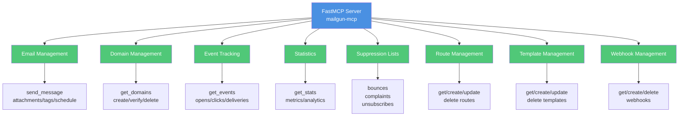

# Mailgun MCP Server

[](https://github.com/lesleslie/crackerjack)
[](https://github.com/lesleslie/oneiric)
[](https://github.com/jlowin/fastmcp)
[](https://github.com/astral-sh/uv)
[](https://www.python.org/downloads/)

This project implements a comprehensive MCP server for the Mailgun API using FastMCP.

## Features

The server provides access to the full Mailgun API including:

- **Email Management**: Send emails with attachments, tags, and scheduled delivery
- **Domain Management**: List, create, update, delete, and verify domains
- **Event Tracking**: Get email events (opens, clicks, deliveries, etc.)
- **Statistics**: Get email statistics and metrics
- **Suppression Lists**: Manage bounces, complaints, and unsubscribes
- **Route Management**: Create and manage routing rules
- **Template Management**: Create and manage email templates
- **Webhook Management**: Configure webhooks for event notifications

### Architecture Overview



## Usage

1. **Set environment variables:**

   ```bash
   export MAILGUN_API_KEY="key-XXXXXXXXXXXXXXXXXXXXXXXXXXXXXXXX"
   # Must be a domain you've added and verified in the Mailgun dashboard,
   # e.g. "mg.example.com" (the *sending* domain, not your root website domain).
   export MAILGUN_DOMAIN="mg.example.com"
   ```

1. **Run the server:**

   The Oneiric CLI starts the server, registers tools, validates the API
   key, and binds the HTTP transport on `http://127.0.0.1:3039` by default.

   ```bash
   python -m mailgun_mcp
   # or, when using uv:
   uv run python -m mailgun_mcp
   ```

   For development with auto-reload, the underlying HTTP ASGI app is
   reachable via `http_app`:

   ```bash
   uvicorn mailgun_mcp.main:http_app --factory --reload
   ```

   In production, drop `--reload`:

   ```bash
   uvicorn mailgun_mcp.main:http_app --factory
   ```

## Installation via Bodai Marketplace

This repo ships a Bodai Claude Code plugin manifest (`.claude-plugin/plugin.json`) plus a colocated `.mcp.json` and three slash commands in `commands/`. To install via the Bodai marketplace, register the marketplace with Claude Code, then install the plugin by name. Once installed, the slash commands `/mailgun-send`, `/mailgun-domains`, and `/mailgun-events` become available alongside the `mcp__mailgun__*` tools. The default HTTP bind is `127.0.0.1:3039`; start the server with `uv run python -m mailgun_mcp` before invoking the commands.

### Configuration

Server settings come from `OneiricMCPConfig` with env prefix
`MAILGUN_MCP_` and `[tool.mailgun-mcp]` in `pyproject.toml`:

| Setting | Env var | Default |
| --- | --- | --- |
| HTTP host | `MAILGUN_MCP_HTTP_HOST` | `127.0.0.1` |
| HTTP port | `MAILGUN_MCP_HTTP_PORT` | `3039` |
| Enable HTTP transport | `MAILGUN_MCP_ENABLE_HTTP_TRANSPORT` | `true` |

1. **Send a test email:**

   ```python
   from fastmcp.client import Client

   async with Client("http://127.0.0.1:3039/mcp") as client:
       result = await client.call_tool(
           "send_message",
           {
               "from": "[email protected]",
               "to": "[email protected]",
               "subject": "Hello from mailgun-mcp",
               "text": "Hello, world!",
           },
       )
       print(result)
   ```

   ```mermaid
   flowchart TD
       Start([Client Request]) --> CheckCreds{API Key?<br/>Domain?}
       CheckCreds -->|No| Error([Return Error])
       CheckCreds -->|Yes| BuildPayload[Build email payload<br/>from/to/subject/html]
       BuildPayload --> HasAttachments{Has<br/>attachments?}
       HasAttachments -->|Yes| EncodeAttach[Base64 encode<br/>attachments]
       HasAttachments -->|No| HasTags{Has tags?}
       EncodeAttach --> HasTags
       HasTags -->|Yes| AddTags[Add tags to<br/>delivery:recipient]
       HasTags -->|No| IsScheduled{Scheduled<br/>delivery?}
       AddTags --> IsScheduled
       IsScheduled -->|Yes| SetSchedule[Set delivery<br/>time]
       IsScheduled -->|No| SendAPI[Send to Mailgun API]
       SetSchedule --> SendAPI
       SendAPI --> Success([Return message ID])

       style Error fill:#E74C3C,color:#fff
       style Success fill:#50C878,color:#fff
       style CheckCreds fill:#F39C12,color:#fff
       style HasAttachments fill:#F39C12,color:#fff
       style HasTags fill:#F39C12,color:#fff
       style IsScheduled fill:#F39C12,color:#fff
   ```

## Available Tools

The MCP server exposes the following tools:

### Email Management

- `send_message`: Send an email message via Mailgun API with support for:
  - Basic email fields (from, to, subject, text)
  - Optional fields (cc, bcc, html)
  - Attachments
  - Tags
  - Scheduled delivery

### Domain Management

- `get_domains`: Get a list of domains from Mailgun
- `get_domain`: Get information about a specific domain from Mailgun
- `create_domain`: Create a new domain in Mailgun
- `delete_domain`: Delete a domain from Mailgun
- `verify_domain`: Trigger verification of a domain in Mailgun

### Events & Logs

- `get_events`: Get email events (opens, clicks, deliveries, etc.) from Mailgun

### Statistics

- `get_stats`: Get email statistics from Mailgun

### Suppression Management

- `get_bounces`: Get email bounces from Mailgun
- `add_bounce`: Add an email address to the bounce list in Mailgun
- `delete_bounce`: Remove an email address from the bounce list in Mailgun
- `get_complaints`: Get email complaints from Mailgun
- `add_complaint`: Add an email address to the complaints list in Mailgun
- `delete_complaint`: Remove an email address from the complaints list in Mailgun
- `get_unsubscribes`: Get unsubscribed email addresses from Mailgun
- `add_unsubscribe`: Add an email address to the unsubscribes list in Mailgun
- `delete_unsubscribe`: Remove an email address from the unsubscribes list in Mailgun

### Route Management

- `get_routes`: Get routes from Mailgun
- `get_route`: Get a specific route from Mailgun
- `create_route`: Create a new route in Mailgun
- `update_route`: Update an existing route in Mailgun
- `delete_route`: Delete a route from Mailgun

### Template Management

- `get_templates`: Get a list of templates from Mailgun
- `get_template`: Get information about a specific template from Mailgun
- `create_template`: Create a new template in Mailgun
- `update_template`: Update an existing template in Mailgun
- `delete_template`: Delete a template from Mailgun

### Webhook Management

- `get_webhooks`: Get all webhooks from Mailgun
- `get_webhook`: Get a specific webhook from Mailgun
- `create_webhook`: Create or update a webhook in Mailgun
- `delete_webhook`: Delete a webhook from Mailgun
